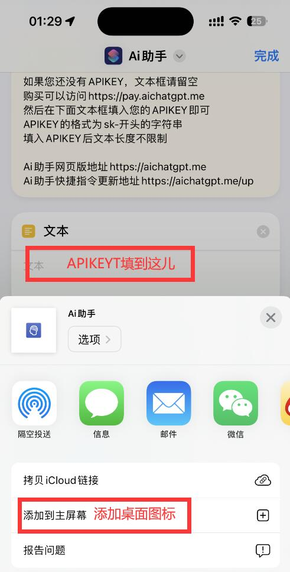
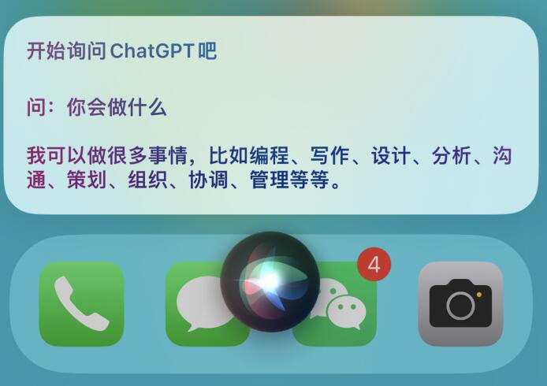
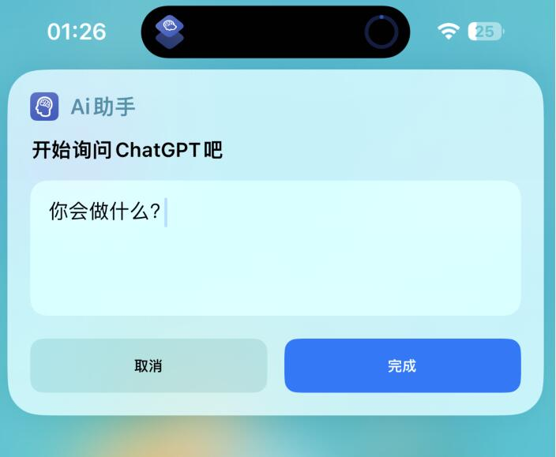

# ChatGPT for Siri

### ChatGPT for Siri快捷指令语音版

🎉 这是一个将ChatGPT集成到Siri的项目，提供快捷命令Siri唤醒使用，无需登录和VPN，也无需账号。

# 下载AI助手快捷命令

💻 下载地址：

https://aichatgpt.me/up （实时更新）

https://www.icloud.com/shortcuts/109788ea4d2f461088b859c7e7718ed8 （iCloud）

# 网页版

🌐 网页版支持中文描述AI图绘制，速度更快：

https://aichatgpt.me/

💰 在这里您可以购买ChatGPT账号和APIKEY（支持一下）：

https://pay.aichatgpt.me/

# APIKEY说明

🔑 如果您有APIKEY，请在文本区域中填入，不填写APIKEY将最多输出300字（使用共享库中的APIKEY，作者承担费用），您可以点击编辑-底部的分享按钮-创建桌面图标。

# 两种使用方法：

1. 🗣️ 在Siri中说：“嘿Siri，Ai助手”，即可打开快捷命令（第一次打开时会有权限提醒，请一直点击“是”）

2. 💻 在快捷命令中或桌面图标点击打开，在输入框下方的框中输入您的问题即可！

# Tips

⚠️ 部分手机可能会遇到文本弹窗的情况，请先用Siri语音运行Ai助手一次，完成第一次问答，一直点击允许，直到报错。然后再从快捷命令中打开Ai助手即可正常使用！！！

🙏 鸣谢：Daiyimo
